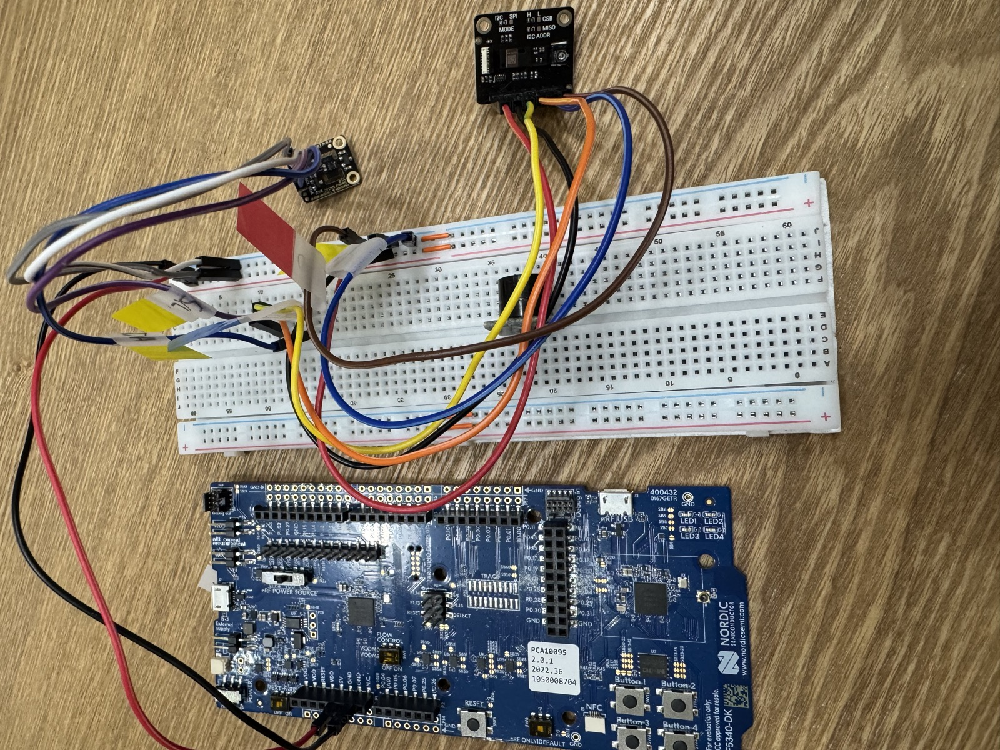
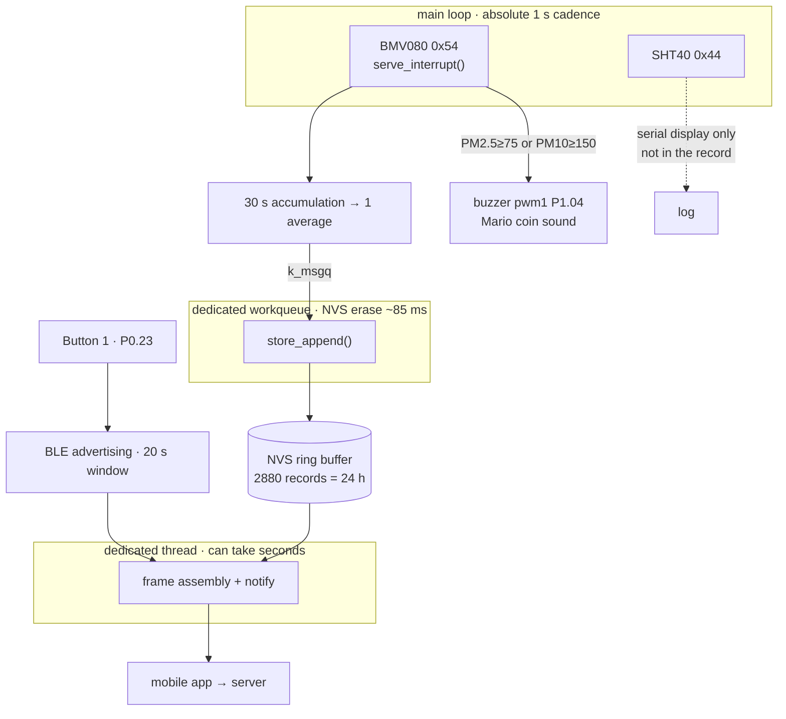
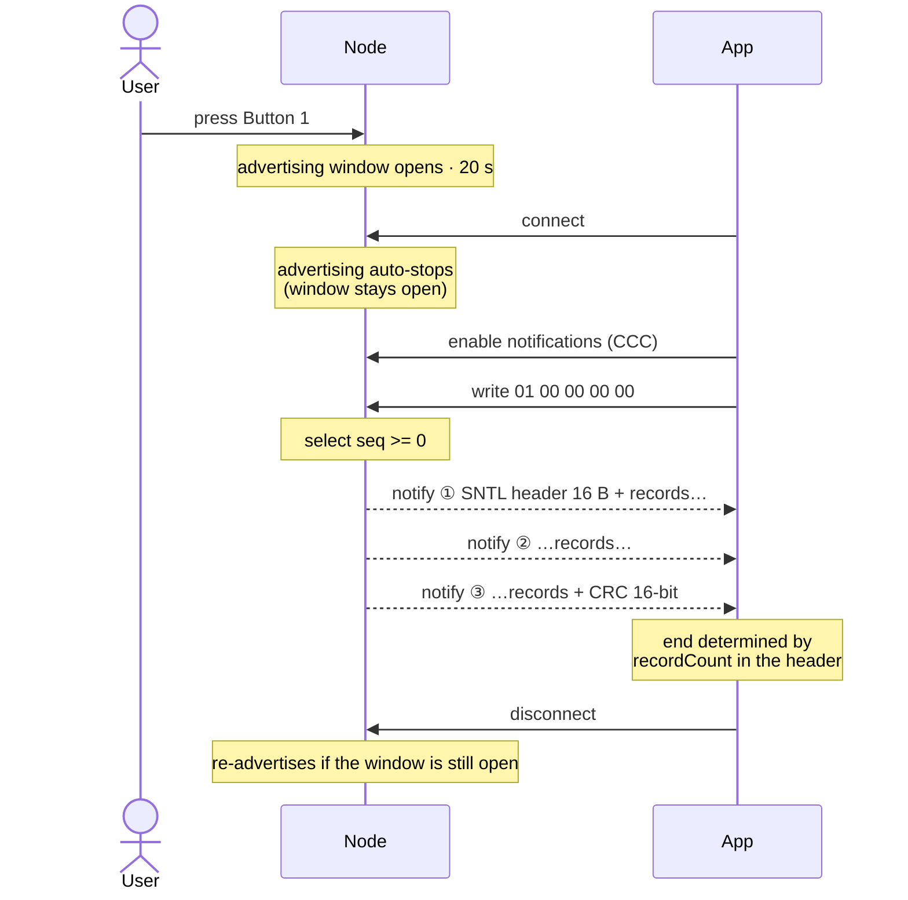

# nRF5340 Wearable — Air Quality Node

> **Sentinel Labs** — the wearable hardware node of a construction-site dust
> monitoring system, built under the **Startup for All (모두의 창업)** startup
> program.

nRF5340 DK (Zephyr / nRF Connect SDK). Reads particulate matter once a second,
**accumulates 30-second averages into flash**, and **hands them to a mobile app
over BLE** at the press of a button. A buzzer sounds when a threshold is crossed.

## Hardware



Top: the **BMV080** breakout — note the `I2C / SPI MODE` silk, the mode pin has
to be strapped for I2C. Left: **SHT40**. Both drop onto the breadboard's shared
`i2c1` rail with the buzzer; the **nRF5340 DK** is below.

**Two sensors share the `i2c1` bus and are told apart only by address.**

| Device | Connection | Notes |
|---|---|---|
| Bosch **BMV080** | `i2c1` `0x54` | PM1/2.5/10. Bosch prebuilt library plus three callbacks |
| Sensirion **SHT40** | `i2c1` `0x44` | Temperature / humidity. Zephyr mainline `sht4x` driver |
| Passive buzzer | `pwm1` **P1.04** (Arduino D2) | Alarm tone |
| Button 1 | **P0.23** (`sw0`) | Opens a 20-second BLE advertising window |

Wiring: `i2c1` = **P1.02 (SDA) / P1.03 (SCL)**, 100 kHz. Pull-ups are the nRF's
internal ones (`bias-pull-up`, roughly 13 kΩ) — fine on the bench, but a real
deployment should use external 10 kΩ resistors.

The BMV080 only comes up in I2C mode if its **PS pin is tied to VDDIO (3.3 V)**.

## Data flow



Only measurement lives in the main loop; **everything slow was moved out of it.**
The BMV080 stalls if it does not get serviced once a second — see
[Timing constraints](#timing-constraints) below.

### Storage

`src/store.c`. One record per NVS entry, ID = `0x100 + (seq % STORE_CAPACITY)`,
which gives a ring buffer for free. Metadata (`next_seq`, `base_sec`) is written
alongside at ID 1 — **`seq` has to survive reboots.** The app and the server
deduplicate on `(device_id, seq)`, so if it wrapped back to 0 the new data would
collide with existing records and be discarded.

The period is one line in `src/store.h`: `STORE_PERIOD_S`. Capacity is derived
from it automatically and always covers 24 hours.

> **It is currently 30 seconds, for testing.** The app's `samplePeriod` and the
> server's `SAMPLE_PERIOD_SECONDS` both assume 60, so before deploying either
> set this back to 60 or change the app and server constants to match.

Batched writes were deliberately left out. A record is 16 B plus an 8 B NVS ATE
= 24 B, roughly 69 KB a day at a 30-second period, against a 160 KB partition
(40 sectors) — a few hundred erases a year against a 10,000-cycle endurance
rating. Batching would buy no lifetime and only widen the loss window on power
cut.

The board's default 32 KB partition left too little room for garbage collection,
so the partition was grown to 160 KB by taking space from `slot1_partition`
(the MCUboot secondary slot, unused here since there is no DFU) — see the bottom
of the overlay.

### Time

**This chip has no calendar clock.** RTC0/RTC1 are just 32.768 kHz counters, and
the DK has no battery-backed RTC. So a record's `ts` is **seconds accumulated
since first boot**, and every record carries the `RTC_UNSET (0x04)` flag. The
receiving side works the wall-clock time back out:

```
real_time(record) = download_time − (current ts − record ts)
```

`base_sec` is written on every store, so the counter increases monotonically
across resets. Only the intervals when power was off are unknown — if that
matters, add an I2C RTC such as a DS3231.

### BLE

`src/ble.c`. NUS-shaped, but not NUS.

| Role | UUID | Property |
|---|---|---|
| Service | `6e400001-b5a3-f393-e0a9-e50e24dcca9e` | — |
| Control (app → node) | `6e400002-...` | Write |
| Data (node → app) | `6e400003-...` | Notify |

**Advertising only starts when Button 1 is pressed, and closes 20 seconds
later.** Pressing again inside the window recharges the 20 seconds. Connectable
advertising is stopped automatically by the stack the moment a connection is
made, so while the window is open the node re-advertises whenever a connection
drops.

The advertising name is the device ID: `SL` + the low 6 hex digits of the
factory ID (e.g. `SLBC5A69`). Exactly 8 bytes, matching the frame's `deviceId`
field character for character.

**Dump command** — 5 bytes written to the control characteristic:

```
0x01  <uint32 LE firstSeq>      send every record with seq >= firstSeq (inclusive)
```

The response arrives as notifications on the data characteristic. It is split
into MTU-sized pieces, but **the chunks have no headers of their own** — the
frame bytes are simply streamed in order. If no matching records exist, an
18-byte zero-record frame is still sent.



**Notifications (CCC) must be enabled before the dump command.** With
notifications off the command is received but there is nowhere to send the data,
so nothing happens.

### Frame format

All integers little-endian. Total length = `16 + 14 × recordCount + 2`.

```
header 16 B   magic "SNTL" | version 1 | recordSize 14 | recordCount u16 | deviceId 8 B
record 14 B   seq u32 | ts u32 | pm25 u16 | pm10 u16 | flags u8 | batt u8
tail    2 B   crc16
```

CRC-16/CCITT-FALSE — poly `0x1021`, init `0xFFFF`, no reflection, no final XOR.
Check vector `"123456789"` → `0x29B1`.

flags: `0x01` SENSOR_FAULT · `0x02` LOW_BATTERY · `0x04` RTC_UNSET ·
`0x08` CALIBRATING · `0x10` THRESHOLD_EXCEEDED (PM10 ≥ 150)

**A record is never dropped for looking anomalous.** It is tagged and sent
anyway — this is occupational-safety data and can end up as legal evidence.

In flash a record occupies **16 bytes** because of struct alignment (2 B of
trailing padding). On the wire `sntl_encode_record()` writes byte by byte, so it
is exactly 14.

## Tuning the BMV080

The library defaults to `HIGH_PRECISION` with a 10-second window, which buries a
puff of dust in the average. Adjust at the top of `src/main.c`:

```c
#define BMV080_ALGORITHM       E_BMV080_MEASUREMENT_ALGORITHM_FAST_RESPONSE
#define BMV080_INTEGRATION_S   5.0f
```

If readings get too jumpy, move the window back toward 10 seconds or switch to
`BALANCED (2)`. Both parameters only take effect if set **before**
`bmv080_start_continuous_measurement()`.

Being optical, it responds far more reliably to **smoke (incense, a match)** than
to coarse dirt. A `[warn] sensor obstructed` message means the optical window is
dirty — blow it out with compressed air.

## Timing constraints

**The BMV080 stalls unless `bmv080_serve_interrupt()` is called at least once a
second.** Hence three things were split off:

- NVS writes → dedicated workqueue (page erase ~85 ms, plus occasional GC)
- BLE dump → dedicated thread (can take seconds)
- Buzzer melody → system workqueue (playing it with `k_msleep` would miss the cadence)

The main loop runs on an **absolute 1-second cadence** based on `k_uptime`, not
`k_msleep(1000)`. `printk` and I2C read times used to add up and push the period
past a second.

## Build

```bash
west build -b nrf5340dk/nrf5340/cpuapp
west flash
```

The BLE controller runs on the network core. `Kconfig.sysbuild` makes the
`ipc_radio` image build alongside, and sysbuild merges and flashes both cores'
hex files. Without it the app core comes up but `bt_enable()` fails.

If readback protection blocks flashing:

```bash
west flash --recover      # erases both cores entirely
```

**Do not touch these** in `prj.conf`:

- `CONFIG_FPU=y` — the Bosch library is m33f (hard-float); a float ABI mismatch breaks the link
- `CONFIG_MAIN_STACK_SIZE=16384` — the Bosch particle algorithm is stack-hungry. 8K overflowed

## Verification

The frame encoder runs on the host, no board needed. `src/frame.c` is pure C
with no Zephyr dependencies — do not add Zephyr headers to it.

```bash
cd tests
gcc -I../src -o test_frame test_frame.c ../src/frame.c && ./test_frame
```

It checks the CRC vector, frame length, header magic, the zero-record frame, and
`firstSeq` boundary conditions.

## Serial output

The nRF5340 DK exposes two VCOM ports. The console is the **second** one (e.g.
COM6). 115200 8N1.

```
[READY] buzzer on P1.04
[READY] store: next seq 4, oldest 0, t=241 s
[READY] BLE up as SLBC5A69 - press Button 1 to advertise
[READY] BMV080 (id: D0LP19153F28)
[START] BMV080 measuring (fast response, 5 s window)
[READY] SHT40
[   371s] PM2.5   5.00  PM10   7.00 ug/m3   T 24.3C  RH 58.2%
[STORE] 390s  PM2.5 12  PM10 16 ug/m3
```

## Related repositories

Presence detection (workers per zone / dwell time) lives in a separate repo:
[JeonJunYoung-hub/Sentinel-Labs-IWRL6432](https://github.com/JeonJunYoung-hub/Sentinel-Labs-IWRL6432) —
a TI mmWave radar, talking over **UART** rather than I2C.

## License note

`src/bmv080/*.a` are Bosch prebuilt binaries. Check the Bosch license for
redistribution terms.
