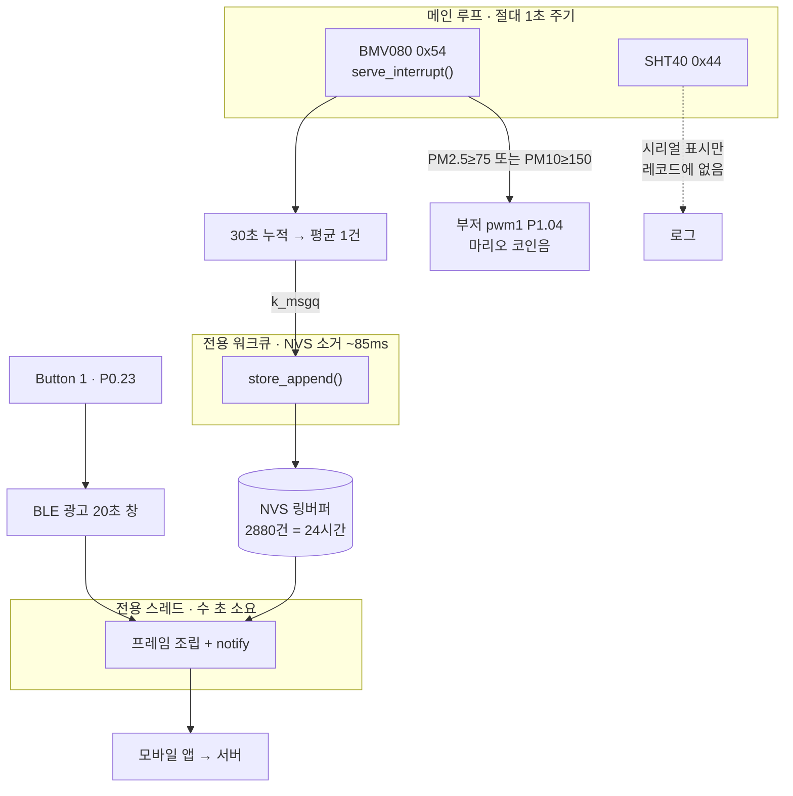
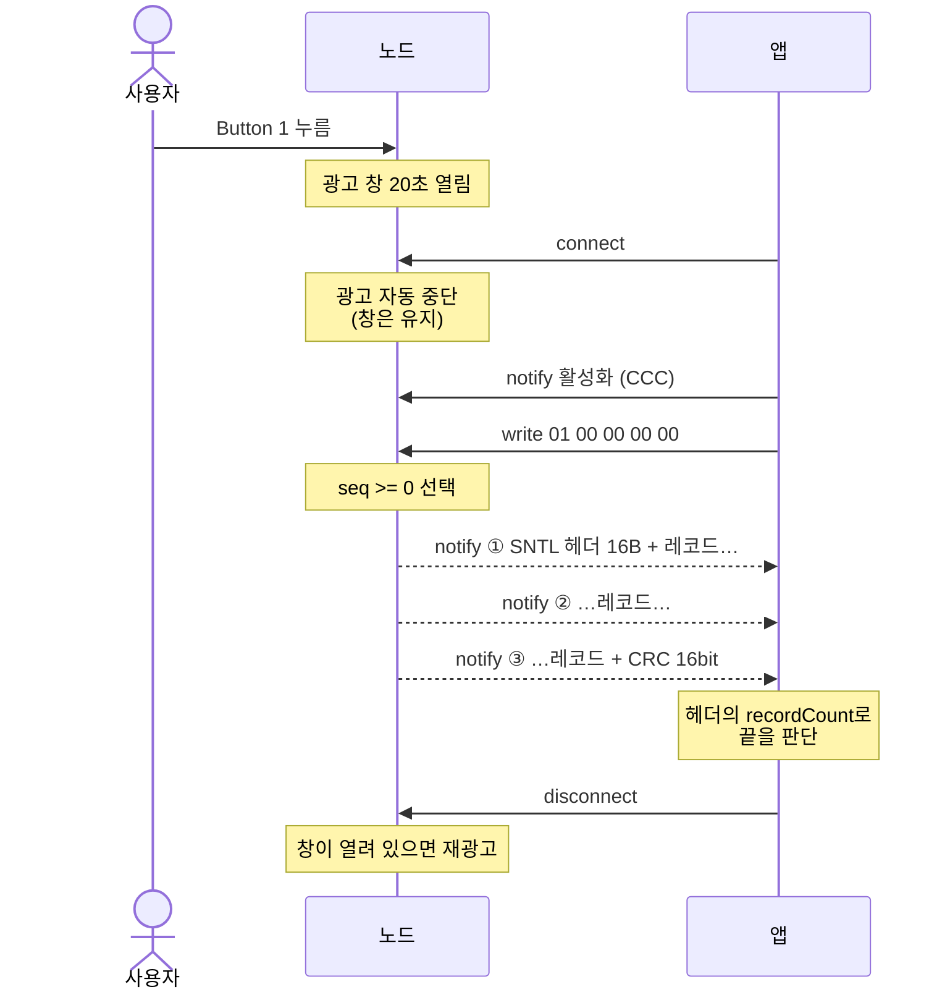

# nRF5340 Wearable — 공기질 측정 노드

> **Sentinel Labs** · **모두의 창업 (Startup for All)** 창업 프로젝트에서 진행 중인
> 건설현장 분진 모니터링 시스템의 하드웨어 노드다.
> Part of a construction-site dust monitoring system built under the
> **Startup for All (모두의 창업)** startup program.

nRF5340 DK (Zephyr / nRF Connect SDK). 미세먼지를 1초마다 읽어 **30초 평균을 플래시에
쌓고**, 버튼을 누르면 **BLE로 모바일 앱에 넘긴다.** 기준치를 넘으면 부저가 운다.

## 하드웨어

**센서 2개가 `i2c1` 버스를 공유하고 주소로만 구분된다.**

| 장치 | 연결 | 비고 |
|---|---|---|
| Bosch **BMV080** | `i2c1` `0x54` | PM1/2.5/10. Bosch 프리빌트 라이브러리 + 콜백 3개 |
| Sensirion **SHT40** | `i2c1` `0x44` | 온습도. Zephyr 메인라인 `sht4x` 드라이버 |
| 패시브 부저 | `pwm1` **P1.04** (Arduino D2) | 경보음 |
| Button 1 | **P0.23** (`sw0`) | BLE 광고 20초 창 열기 |

배선: `i2c1` = **P1.02 (SDA) / P1.03 (SCL)**, 100 kHz. 풀업은 nRF 내부 풀업
(`bias-pull-up`, 약 13 kΩ)을 켜뒀다 — 벤치용이고 실사용에선 외부 10 kΩ 를 다는 게 맞다.

BMV080은 **PS 핀을 VDDIO(3.3V)에 묶어야** I2C 모드로 뜬다.

## 데이터 흐름



측정만 메인 루프에 있고, **오래 걸리는 일은 전부 밖으로 뺐다.** BMV080이 1초에 한 번
서비스를 못 받으면 멈추기 때문이다 — 아래 [타이밍 제약](#타이밍-제약) 참고.

### 저장

`src/store.c`. NVS 엔트리 하나에 레코드 하나, ID = `0x100 + (seq % STORE_CAPACITY)`
라서 링버퍼가 공짜로 된다. 별도로 ID 1 에 메타(`next_seq`, `base_sec`)를 같이 쓴다 —
**`seq` 는 재부팅을 넘어 이어져야 한다.** 앱과 서버가 `(device_id, seq)` 로 중복을
거르기 때문에 0으로 돌아가면 새 데이터가 기존 것과 충돌해 버려진다.

주기는 `src/store.h` 의 `STORE_PERIOD_S` 한 줄. 용량은 거기서 자동 계산돼 항상 24시간치다.

> **지금은 테스트용 30초다.** 앱의 `samplePeriod` 와 서버의 `SAMPLE_PERIOD_SECONDS` 가
> 60초를 전제하므로, 배포 전에 60으로 되돌리거나 앱·서버 상수를 같이 바꿔야 한다.

배치 쓰기는 일부러 안 했다. 레코드 16 B + NVS ATE 8 B = 24 B, 30초 주기로 하루 약 69 KB
인데 파티션이 160 KB(40섹터)라 연간 수백 회 소거로 끝난다(내구성 1만 회). 배치는 수명
이득 없이 전원 차단 시 손실만 늘린다.

파티션은 보드 기본 32 KB로는 GC 공간이 모자라서, DFU를 안 쓰는 `slot1_partition`
(MCUboot 세컨더리)에서 떼어와 160 KB로 키웠다 — 오버레이 하단 참고.

### 시간

**이 칩에는 달력 시계가 없다.** RTC0/RTC1은 32.768 kHz 카운터일 뿐이고 DK에 배터리
백업 RTC도 없다. 그래서 레코드의 `ts` 는 **최초 부팅 이후 누적 초**이고, 모든 레코드에
`RTC_UNSET (0x04)` 플래그가 선다. 실제 시각은 받는 쪽이 역산한다:

```
실제시각(레코드) = 다운로드시각 − (현재 ts − 레코드 ts)
```

`base_sec` 을 매 저장마다 같이 쓰므로 리셋을 넘어서도 단조 증가한다. 전원이 꺼져 있던
구간만 알 수 없다 — 그게 문제라면 DS3231 같은 I2C RTC를 달면 된다.

### BLE

`src/ble.c`. NUS 모양이지만 NUS가 아니다.

| 역할 | UUID | 속성 |
|---|---|---|
| 서비스 | `6e400001-b5a3-f393-e0a9-e50e24dcca9e` | — |
| 제어 (앱→노드) | `6e400002-...` | Write |
| 데이터 (노드→앱) | `6e400003-...` | Notify |

**광고는 Button 1 을 눌러야 시작하고 20초 뒤 닫힌다.** 창 안에서 다시 누르면 20초가
재충전된다. connectable 광고는 연결되는 순간 스택이 자동으로 멈추므로, 창이 열려 있는
동안은 연결이 끊기면 다시 광고한다.

광고 이름 = 기기 ID = `SL` + 팩토리 ID 하위 6 hex (예: `SLBC5A69`). 정확히 8바이트라
프레임의 `deviceId` 필드와 글자 그대로 일치한다.

**덤프 명령** — 제어 캐릭터리스틱에 5바이트:

```
0x01  <uint32 LE firstSeq>      seq >= firstSeq 인 레코드를 전부 보내라 (초과 아님)
```

응답은 데이터 캐릭터리스틱 notify. MTU 단위로 쪼개지만 **조각에 자체 헤더는 없다** —
프레임 바이트를 순서대로 흘린다. 해당 레코드가 없어도 0건짜리 18바이트 프레임을 보낸다.



**알림(CCC) 활성화가 덤프 명령보다 먼저**여야 한다. 알림이 꺼져 있으면 명령을 받아도
보낼 곳이 없어 아무 일도 일어나지 않는다.

### 프레임 포맷

모든 정수 리틀엔디언. 전체 길이 = `16 + 14 × recordCount + 2`.

```
헤더 16B   magic "SNTL" | version 1 | recordSize 14 | recordCount u16 | deviceId 8B
레코드 14B  seq u32 | ts u32 | pm25 u16 | pm10 u16 | flags u8 | batt u8
꼬리 2B    crc16
```

CRC-16/CCITT-FALSE — poly `0x1021`, init `0xFFFF`, 반전 없음, 최종 XOR 없음.
검증 벡터 `"123456789"` → `0x29B1`.

flags: `0x01` SENSOR_FAULT · `0x02` LOW_BATTERY · `0x04` RTC_UNSET ·
`0x08` CALIBRATING · `0x10` THRESHOLD_EXCEEDED (PM10 ≥ 150)

**이상값이라고 레코드를 버리지 않는다.** 태그만 붙여서 보낸다 — 안전관리 데이터라
법적 증빙이 될 수 있어서다.

플래시에 저장될 때는 구조체 정렬 때문에 **16바이트**(끝에 패딩 2B)를 차지한다.
전송은 `sntl_encode_record()` 가 바이트 단위로 쓰므로 정확히 14바이트다.

## BMV080 튜닝

라이브러리 기본값은 `HIGH_PRECISION` + 10초 윈도우라 먼지를 훅 불어도 평균에 묻힌다.
`src/main.c` 상단에서 조정한다:

```c
#define BMV080_ALGORITHM       E_BMV080_MEASUREMENT_ALGORITHM_FAST_RESPONSE
#define BMV080_INTEGRATION_S   5.0f
```

값이 너무 튀면 윈도우를 10초 쪽으로 올리거나 `BALANCED (2)` 로. 두 파라미터 모두
**`bmv080_start_continuous_measurement()` 전에** 설정해야 먹는다.

광학식이라 굵은 흙먼지보다 **연기(모기향, 성냥)** 가 훨씬 확실하게 반응한다.
`[warn] sensor obstructed` 가 뜨면 광학창이 오염된 것 — 에어더스터로 불어낸다.

## 타이밍 제약

**BMV080은 최소 1초에 한 번 `bmv080_serve_interrupt()` 를 받아야 멈추지 않는다.**
그래서 셋을 분리해뒀다:

- NVS 쓰기 → 전용 워크큐 (페이지 소거 ~85 ms + 가끔 GC)
- BLE 덤프 → 전용 스레드 (수 초 걸릴 수 있음)
- 부저 멜로디 → 시스템 워크큐 (`k_msleep` 로 재생하면 주기를 놓친다)

메인 루프는 `k_msleep(1000)` 이 아니라 `k_uptime` 기준 **절대 1초 케이던스**다.
printk 와 I2C 읽기 시간이 더해져 주기가 1초를 넘던 문제가 있었다.

## 빌드

```bash
west build -b nrf5340dk/nrf5340/cpuapp
west flash
```

BLE 컨트롤러는 네트워크 코어에서 돈다. `Kconfig.sysbuild` 가 `ipc_radio` 이미지를
같이 빌드하게 하고, sysbuild 가 두 코어 hex 를 합쳐 굽는다. 이게 없으면 앱 코어는
뜨지만 `bt_enable()` 이 실패한다.

리드백 보호가 걸려 플래시가 거부되면:

```bash
west flash --recover      # 두 코어 플래시가 전부 지워진다
```

`prj.conf` 에서 **건드리면 안 되는 것**:

- `CONFIG_FPU=y` — Bosch 라이브러리가 m33f(하드플로트)라 float ABI가 안 맞으면 링크가 깨진다
- `CONFIG_MAIN_STACK_SIZE=16384` — Bosch 파티클 알고리즘이 스택을 많이 쓴다. 8K에서 오버플로우 났다

## 검증

프레임 인코더는 보드 없이 호스트에서 돌린다. `src/frame.c` 는 Zephyr 의존성이 없는
순수 C 다 — 여기에 Zephyr 헤더를 추가하지 말 것.

```bash
cd tests
gcc -I../src -o test_frame test_frame.c ../src/frame.c && ./test_frame
```

CRC 검증 벡터, 프레임 길이, 헤더 매직, 0건 프레임, `firstSeq` 경계값을 확인한다.

## 시리얼 확인

nRF5340 DK 는 VCOM 두 개를 만든다. 콘솔은 **두 번째**(예: COM6)다. 115200 8N1.

```
[READY] buzzer on P1.04
[READY] store: next seq 4, oldest 0, t=241 s
[READY] BLE up as SLBC5A69 - press Button 1 to advertise
[READY] BMV080 (id: D0LP19153F28)
[START] BMV080 measuring (fast response, 5 s window)
[READY] SHT40
[   371s] PM2.5   5.00  PM10   7.00 ug/m3   T 24.3C  RH 58.2%
[STORE] 390s  PM2.5 12  PM10 16 ug/m3
```

## 관련 저장소

재실 감지(구역별 근로자 수 / 체류 시간)는 별도 저장소:
[JeonJunYoung-hub/IWRL6432](https://github.com/JeonJunYoung-hub/IWRL6432) — TI mmWave
레이더, I2C가 아니라 **UART** 로 통신한다.

## 라이선스 주의

`src/bmv080/*.a` 는 Bosch 프리빌트 바이너리다. 재배포 조건은 Bosch 라이선스를 확인할 것.
